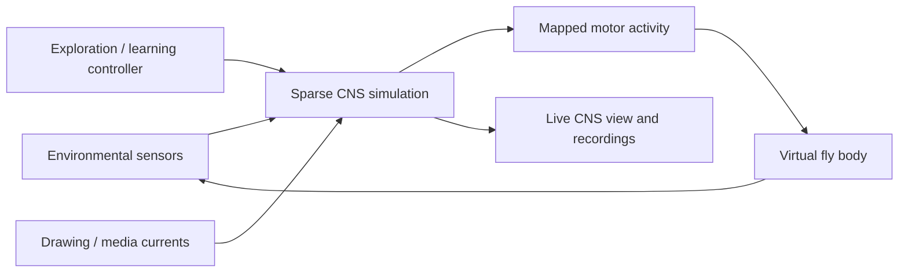

# FlyBrain

An interactive fruit fly connectome simulator: stimulate neurons, watch activity propagate through anatomical connections, and explore how mapped motor output moves a virtual fly.

FlyBrain connects the Drosophila Male CNS dataset to sparse neural simulation, GPU rendering, and a live 3D arena. It brings together scientific data processing, GPU computing, interactive graphics, and reinforcement learning in one local Python project.

**Stack:** Python · NumPy / SciPy · pandas / PyArrow · PyTorch / ROCm · ModernGL / OpenGL · GLFW

> This is an experimental model built from anatomical data. Neural dynamics, sensory mappings, and body movement are simplified assumptions; simulated behavior is not validated fly physiology.

## What you can do

- **Explore the CNS in 3D.** Orbit an anatomical cell map, select neurons, inspect spike counts, and display locally cached neuron branches.
- **Run a live virtual fly.** Environmental sensory input passes through the sparse connectome to mapped motors, driving a procedural body with walking, takeoff, and landing.
- **Paint stimulation onto neurons.** Draw on the CNS view or load local video/audio; image brightness and audio spectrograms become spatially mapped input currents.
- **Run targeted experiments.** Stimulate individual body IDs or annotated sensory populations, inspect motor responses, and replay recorded activity.
- **Experiment with learning.** A persistent tabular Q-learning controller selects sensory-drive and flight actions. A separate evaluator compares trained, untrained, and fixed controllers across seeds.
- **Inspect the results.** Export spike events, counts, motor summaries, trajectories, and run configuration for analysis.

## How it works



The source graph stores anatomical weights as `W[pre, post]`. Vectorized propagation uses `W.T @ activity`, with presynaptic transmitter signs and outgoing-weight normalization applied by the simulator. Connectivity stays sparse throughout; no dense whole-CNS matrix is created.

The CPU implementation is the reference. PyTorch provides GPU simulation, including AMD GPUs through ROCm. The live arena uses a separate graph projection that retains bodies with a nonzero modeled transmitter sign or a superclass annotation, preserving original outgoing normalization. Neural stepping and rendering run separately.

### Dataset scale

The local `male-cns:v1.0` audit and derived live cache contain:

| Representation | Size |
| --- | ---: |
| Source graph body IDs | 88,384,522 |
| Source anatomical edges | 151,856,684 |
| Synapses represented by edge weights | 311,833,243 |
| Retained bodies in the live projection | 167,176 |
| Live anatomical edges before runtime filtering | 25,638,687 |
| Retained bodies with positions for the CNS map | 140,635 |

Graph body IDs are not equivalent to fully annotated neurons: most source IDs have no metadata row. The CNS view shows available soma/root positions and a cached subset of arbors, not every neurite or synapse. Omitted zero-sign bodies cannot feed back under the current model, but their activity is not recorded by the live projection.

## Setup

Run all commands from the repository root after cloning it.

### 1. Prepare Python and dependencies

Development and GPU validation used Linux, Python 3.13, and an AMD Radeon RX 9070 XT with approximately 16 GB VRAM on a 32 GB RAM machine. These are development-machine specifications, not measured minimum requirements. Other platforms and GPU configurations have not been validated here.

```bash
python3 -m venv .venv
source .venv/bin/activate
python -m pip install --upgrade pip
python -m pip install numpy scipy pandas pyarrow google-cloud-storage moderngl glfw Pillow
```

Install **PyTorch** separately using the [official installation selector](https://pytorch.org/get-started/locally/), choosing a build compatible with your GPU and drivers. For AMD acceleration, use ROCm. Its PyTorch API still uses `torch.cuda`:

```bash
python -c 'import torch; print("GPU available:", torch.cuda.is_available()); print("ROCm:", torch.version.hip)'
```

The viewer needs an OpenGL 3.3-capable driver and a graphical session. The arena accepts `--device cpu` for a CPU fallback, although interactive performance will depend on the machine.

Optional dependencies:

- `python -m pip install neuprint-python` for downloading neuron skeletons.
- `python -m pip install matplotlib` for the older plotting/debug viewers.
- System-installed **FFmpeg / ffplay** for media decoding and audio playback.
- **Zenity** or **KDialog** for the media file picker; `--media PATH` also accepts a local file directly.

### 2. Download and build the connectome

```bash
python -m src.download_full
python -m src.build_full
python -m src.motor_map
python -m src.sensory_map
```

The downloader retrieves three public bulk tables from:

```text
gs://flyem-male-cns/v1.0/connectome-data/flat-connectome/
```

Bulk download uses anonymous access; neuPrint credentials are only needed for online skeleton retrieval. Raw data, generated caches, and run outputs are excluded from Git and must be created locally.

This is a substantial data build. The development checkout uses roughly **1.1 GB for raw tables and 13 GB for caches**, with additional space needed for runs and temporary build allocations. A single full-graph float32 state vector alone occupies about 337 MiB. Allow substantial RAM and disk headroom; the build is not a lightweight first-run download.

### 3. Launch the arena

```bash
python -m src.fly_arena
```

The first launch builds the derived live graph cache. Subsequent launches reuse it. Learning is enabled by default and persists in `data/cache/arena_policy_v1.json`.

For a first look with fixed exploratory stimulation:

```bash
python -m src.fly_arena --no-learning
```

Open directly into the CNS map:

```bash
python -m src.fly_arena --view brain --no-learning
```

Neuron branches require separately cached skeletons; the arena can run without them. The body is generated procedurally and does not require a downloaded fly mesh.

### Essential controls

| Control | Action |
| --- | --- |
| Tab | Switch arena / CNS view |
| Mouse drag / scroll | Orbit / zoom |
| Space | Pause or resume |
| 1 / 2 | Stimulate left / right leg sensory populations |
| F | Request takeoff / landing |
| V | Toggle the engineered visual steering assist |
| Click, then Z in CNS view | Select and focus a neuron |
| D in CNS view | Toggle drawing mode |
| O in CNS view | Open local media |
| I in CNS view | Toggle drawing/media current injection |
| Esc | Save outputs and exit |

Full controls, learning behavior, and experiment details are in [ARENA.md](ARENA.md).

## Example experiments

### Stimulate a known descending neuron

Stimulate **DNg15_R (`513052`)** and monitor **Ti extensor MN_L (`815344`)**:

```bash
python -m src.sim_full_gpu \
  --stimulate 513052 --target 815344 \
  --steps 500 --output runs/dng15_demo
```

Use `src.sim_full` with the same arguments for the CPU reference implementation. Full-graph experiments have a larger memory footprint than the live projection.

### Cache morphologies and replay a run

Install `neuprint-python`, obtain your token through [neuPrint](https://neuprint.janelia.org/), and make it available as `NEUPRINT_APPLICATION_CREDENTIALS` in the shell. Keep credentials out of source files and Git.

```bash
python -m src.cache_run_skeletons --run runs/dng15_demo --max-neurons 40
python -m src.fly_brain_opengl --run runs/dng15_demo
```

Once skeletons are cached, replay works offline. Use the same cache in the arena:

```bash
python -m src.fly_arena --skeleton-run runs/dng15_demo
```

### Play media into the CNS

```bash
python -m src.fly_arena --view brain --no-learning --media /path/to/video.mp4
```

Bright pixels inject bounded external current at projected soma/root positions. Audio files generate spectrogram input. This is direct imposed stimulation, not a model of biological vision or hearing; changing the camera changes the mapping.

### Run without a window

```bash
python -m src.fly_arena --headless-steps 3600 --no-learning \
  --output runs/headless_demo
```

This runs 60 simulated seconds at the default neural clock. Simulated time and wall-clock time may differ.

## Outputs and validation

Normal runs export `spike_events.npz`, `spike_counts.npz`, `params.json`, `top_active.csv`, and `active_motor_neurons.csv`. Arena sessions also export `trajectory.csv`, plus policy and stimulus records when applicable.

Event recording is bounded. Spike counts can continue after the event cap, so inspect completion and truncation metadata in `params.json` before treating a run as a complete replay. Use a fresh output directory for each experiment.

Run the regression suite:

```bash
python -B -m unittest discover -s tests -v
```

Tests cover CPU/GPU propagation agreement, graph projection, recording integrity, motor-dependent movement, learning persistence, visual input, and rendering. GPU and offscreen rendering checks depend on device access and EGL; unavailable capabilities may be skipped.

Audit the locally built source graph and known anatomical connections:

```bash
python -m src.audit_connectome --check-edges --output runs/connectome_audit.json
```

## Modeling limits

- **Transmitter effects are simplified:** acetylcholine is `+1`, GABA is `−1`, and all other transmitters are `0`. Receptor-specific effects are not modeled.
- **Neural dynamics are a toy model:** leak, thresholds, resets, input currents, and neural-to-arena timing are imposed parameters.
- **Movement is kinematic:** gait, motor decoding, collision geometry, and flight are engineered approximations, without realistic muscles or aerodynamics.
- **Vision includes synthetic mappings:** raycast RGB/depth sectors map onto annotated visual relays without measured retinal assignments. The default obstacle-avoidance assist is an engineered controller.
- **Learning is external to the connectome:** Q-learning chooses stimulation actions and flight requests; it does not modify anatomical weights or model biological synaptic plasticity. A short paired evaluation did not improve mean coverage over the baselines, so improved navigation is not established.

## Project map

| Module | Purpose |
| --- | --- |
| `src/download_full.py`, `src/build_full.py` | Bulk data ingestion and sparse graph construction |
| `src/sim_full.py`, `src/sim_full_gpu.py` | CPU reference and GPU batch simulation |
| `src/live_brain.py`, `src/arena_session.py` | Live graph projection, neural stepping, session lifecycle |
| `src/fly_arena.py`, `src/arena_render.py` | Interactive arena and rendering |
| `src/brain_view.py`, `src/brain_media.py` | CNS map, painting, and media input |
| `src/arena_model.py`, `src/arena_vision.py` | Body kinematics and environmental sensing |
| `src/arena_learning.py`, `src/evaluate_arena.py` | Persistent controller and paired evaluation |
| `src/fly_brain_opengl.py`, `src/run_data.py` | Recorded-run visualization and compatible data loading |
| `tests/` | Regression and integration checks |

## Next steps

- Evaluate longer training runs and more challenging navigation starts.
- Improve credit assignment, task goals, and stuck recovery.
- Add more realistic articulated contact and body mechanics.
- Expand morphology coverage and reproducible stimulation experiments.

## Data and acknowledgments

FlyBrain uses the **Drosophila Male CNS `male-cns:v1.0`** connectome, annotations, and neuron reconstructions provided by the Janelia FlyEM project. Skeleton retrieval uses [neuPrint](https://neuprint.janelia.org/).

The underlying anatomical reconstructions are the work of their dataset creators; FlyBrain provides the simulation and visualization software built around them. Consult the original data providers for dataset attribution and reuse terms.
